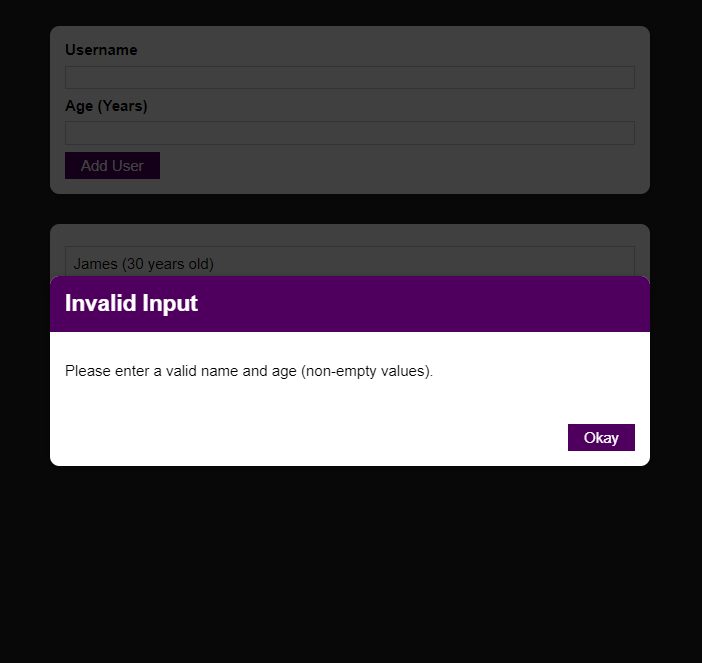

# User Ages List App
***This is a single page app that includes core features of React projects such as:***
- Components
- States & Events
- Rendering Lists
- CSS Modules

## Install
1. Clone the repository
2. Run `npm install` command for installing related dependencies
3. Run `npm start` command for starting the server

## Screens

